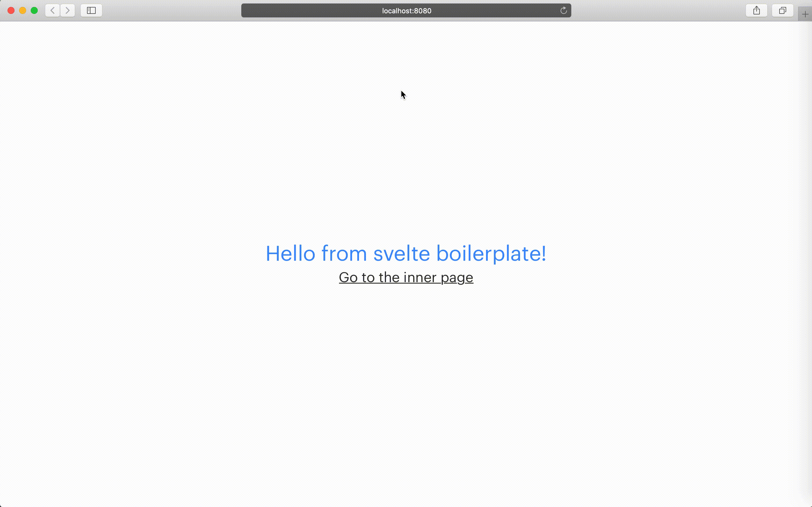

This is svelte webpack boilerplate. We support the following features:

- **Core tools**
- - ✅ [Svelte](https://github.com/sveltejs/svelte) v3.12.1.
- - ✅ [Webpack](https://github.com/webpack/webpack) v4.28.4.
- **Styles tools**
- - ✅ [Postcss](https://github.com/postcss/postcss) v7.0.18.
- **Support tools**
- - ✅ [Babel](https://github.com/babel/babel) v7.6.4.
- - ✅ [Node version manager](https://github.com/nvm-sh/nvm).
- **CI/CD tools**
- - ✅ [Docker](https://www.docker.com).
- - ✅ [Depler](https://github.com/gustarus/depler) (docker deployment tool) v1.7.8.
- - ✅ [Gitlab-CI](https://docs.gitlab.com/ee/ci/).
- **Code style tools**
- - ✅ [Prettier](https://github.com/prettier/prettier) ?.
- - ✅ [Eslint](https://github.com/eslint/eslint) v6.1.0.
- - ✅ [Stylelint](https://github.com/stylelint/stylelint) v10.1.0.


## How it looks like?
Demo site has only two pages with navigation between them.



## How to start webpack locally?
We support webpack from the box. [Look a demo on youtube](https://youtu.be/KNiKJi6TYgY).

1. **Install all dependencies**
```bash
npm i
```

2. **Start webpack dev server**
```bash
npm start
```

3. **Open the site**
```bash
open localhost:8080
```

## How to use docker locally?
We support docker from the box. [Look a demo on youtube](https://youtu.be/DbVK2JaVIM0).

1. **Create docker image with the project**
```bash
npm run docker:build
```

2. **Start the container in background**
```bash
npm run docker:build
```

If you want to see docker logs.
```bash
npm run docker:logs
```

If you want to stop the container.
```bash
npm run docker:clean
```

3. **Open the site**
```bash
open localhost:8080
```
